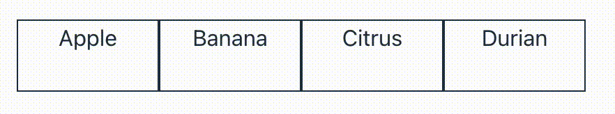
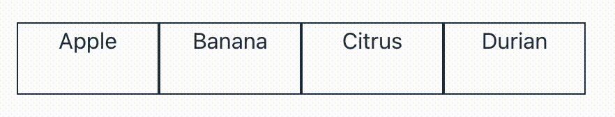
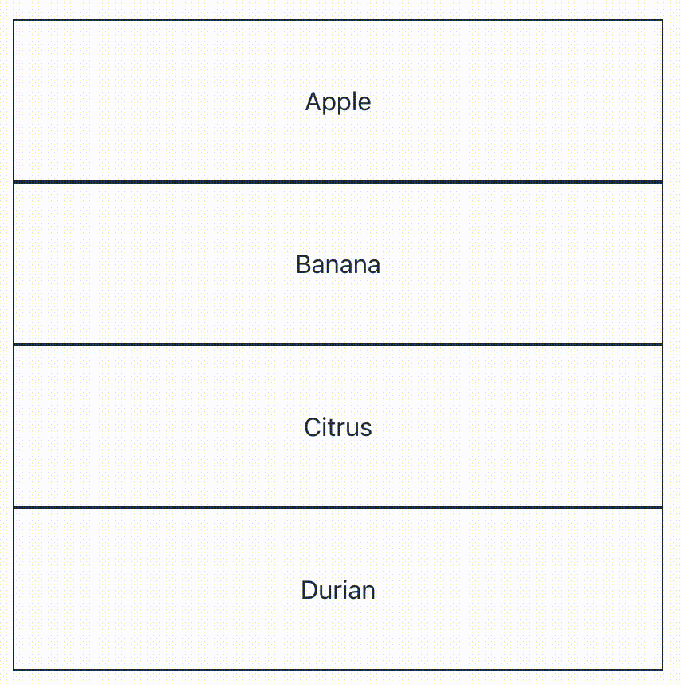

# react-swap-motion-ui

順番の入れ替えUIを持つReactコンポーネントです。

## インストール

```shell
npm i react react-dom
npm i boushi-bird/react-swap-motion-ui#0.0.2
```

## 利用方法

### 基本的な使い方

```tsx
import { useState } from "react";
import { SwapMotionUI } from "@boushi-bird/react-swap-motion-ui";

export function Example() {
  const [items, setItems] = useState([
    { id: 1, name: "Apple" },
    { id: 2, name: "Banana" },
    { id: 3, name: "Citrus" },
    { id: 4, name: "Durian" },
  ]);
  return (
    <div style={{ display: "flex" }}>
      {items.map((v, index) => (
        <SwapMotionUI
          key={v.id}
          index={index}
          items={items}
          onSwapPosition={setItems}
        >
          <div
            style={{
              width: "100px",
              height: "50px",
              border: "solid 1px",
              display: "flex",
              justifyContent: "center",
            }}
          >
            {v.name}
          </div>
        </SwapMotionUI>
      ))}
    </div>
  );
}
```



### アニメーションの速度等のカスタマイズ

```tsx
import { useState } from "react";
import { SwapMotionUI } from "@boushi-bird/react-swap-motion-ui";

export function Example() {
  const [items, setItems] = useState([
    { id: 1, name: "Apple" },
    { id: 2, name: "Banana" },
    { id: 3, name: "Citrus" },
    { id: 4, name: "Durian" },
  ]);
  return (
    <div style={{ display: "flex" }}>
      {items.map((v, index) => (
        <SwapMotionUI
          key={v.id}
          index={index}
          items={items}
          onSwapPosition={setItems}
          transitionDuration="1500ms"
          transitionTimingFunction="steps(6, end)"
        >
          <div
            style={{
              width: "100px",
              height: "50px",
              border: "solid 1px",
              display: "flex",
              justifyContent: "center",
            }}
          >
            {v.name}
          </div>
        </SwapMotionUI>
      ))}
    </div>
  );
}
```



### ボタンのカスタマイズ

```tsx
import { useState } from "react";
import { SwapMotionUI } from "@boushi-bird/react-swap-motion-ui";

export function Example() {
  const [items, setItems] = useState([
    { id: 1, name: "Apple" },
    { id: 2, name: "Banana" },
    { id: 3, name: "Citrus" },
    { id: 4, name: "Durian" },
  ]);
  return (
    <div style={{ display: "flex", flexDirection: "column" }}>
      {items.map((v, index) => (
        <SwapMotionUI
          key={v.id}
          index={index}
          items={items}
          onSwapPosition={setItems}
          renderMovePreviousButton={(onClick) => (
            <button
              style={{
                position: "absolute",
                fontSize: "12px",
                width: "80px",
                height: "28px",
                top: "0",
                right: "0",
                left: "0",
                margin: "auto",
              }}
              onClick={onClick}
            >
              up
            </button>
          )}
          renderMoveNextButton={(onClick) => (
            <button
              style={{
                position: "absolute",
                fontSize: "12px",
                width: "80px",
                height: "28px",
                right: "0",
                left: "0",
                bottom: "0",
                margin: "auto",
              }}
              onClick={onClick}
            >
              down
            </button>
          )}
        >
          <div
            style={{
              height: "100px",
              border: "solid 1px",
              display: "flex",
              justifyContent: "center",
              alignItems: "center",
            }}
          >
            {v.name}
          </div>
        </SwapMotionUI>
      ))}
    </div>
  );
}
```


